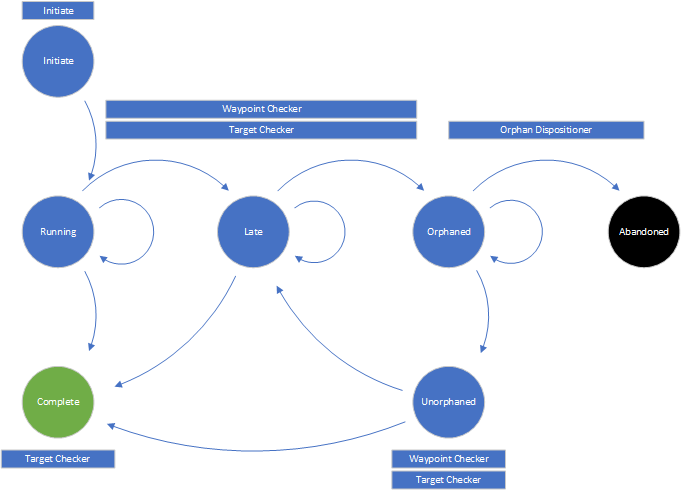

# Synthetic Transactions

## Synthetic Transaction State Flow

### States
State | Description
----- | -----------
Initiate | XXXX
Running | XXXX
Complete | XXXX
Late | XXXX
Orphaned | XXXX
Unorphaned | XXXX
Abandoned | XXXX

# springboot-k8s-mysql

# This is an <h1> tag
## This is an <h2> tag
###### This is an <h6> tag

*This text will be italic*
_This will also be italic_

**This text will be bold**
__This will also be bold__

_You **can** combine them_

Unordered lists
* Item 1
* Item 2
  * Item 2a
  * Item 2b
    * Yep really in there

Ordered Lists
1.  Hello
1.  There
    1. Tom
    1. Maureen

First Header | Second Header
------------ | -------------
Content from cell 1 | Content from cell 2
Content in the first column | Content in the second column
